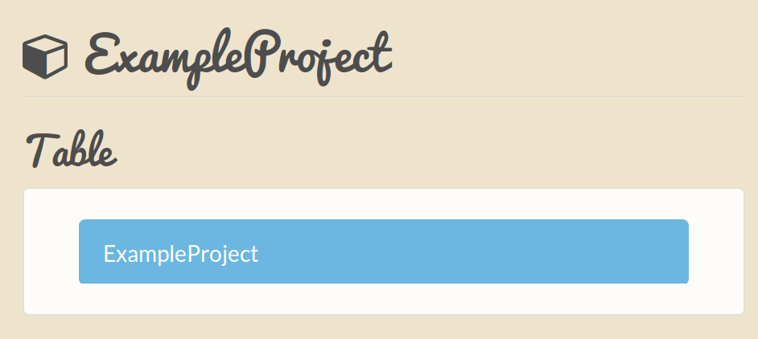
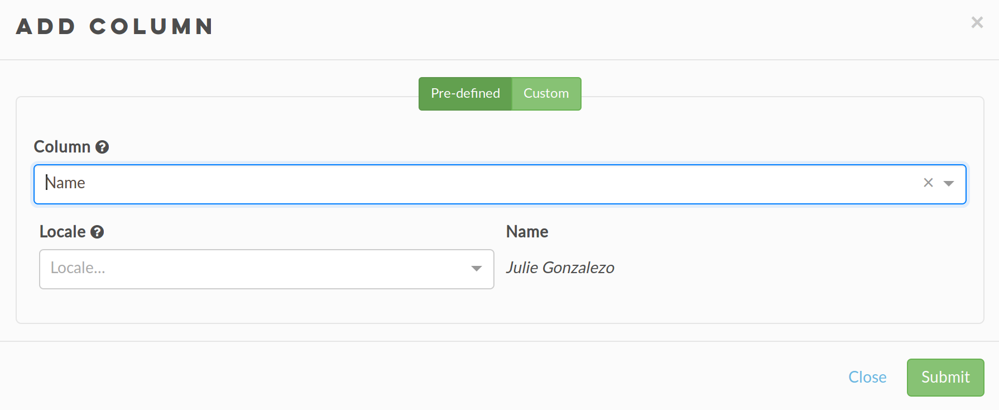
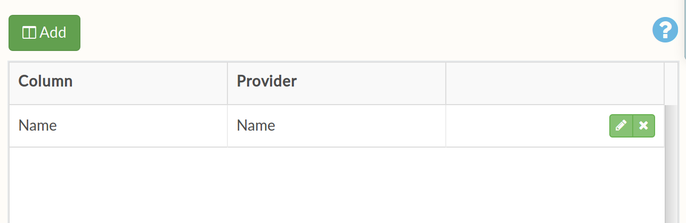
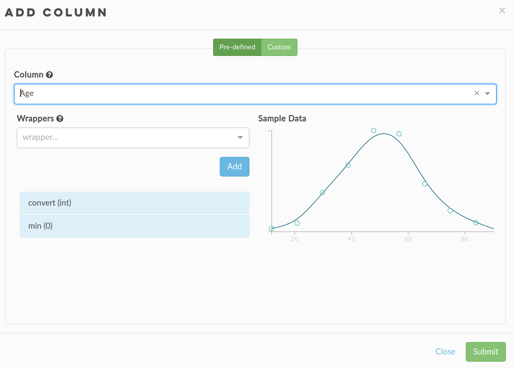
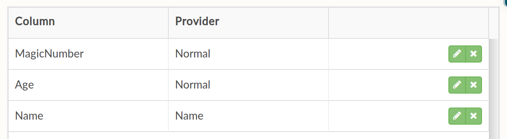
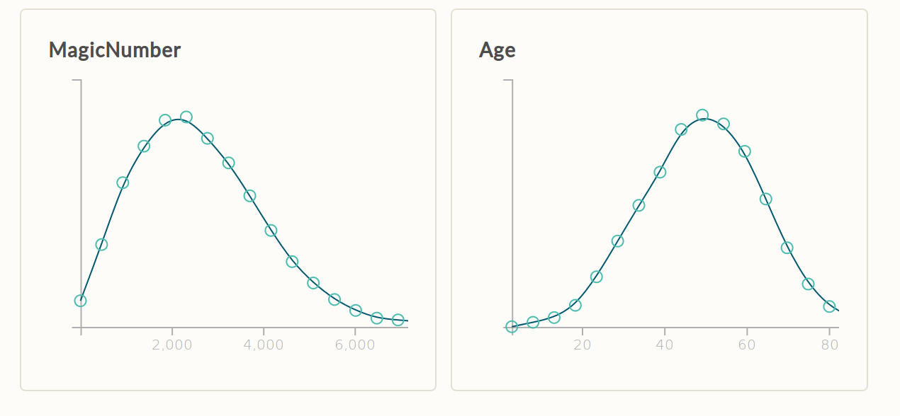
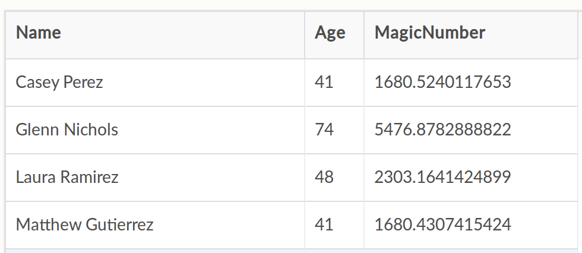

Quickstart
==========

(What to accomplish)

To get started, enter a project name under the 'Create a new project' heading and click 'Let's go'. This will enable you to track your projects and change the datasets later. Alternatively, you can load a template dataset.

.. image:: images/quickstart/createproject.png

Creating a new project will take you through to the main page - where you can define the variables and the insights in your personalised generated dataset. Project names on the top left-hand side as a title above the table list. Below, you can re-name the table you are about to generate – this is especially relevant if you plan on generating multiple tables in the same project.

You will also notice that a help icon on the top right of the main body and in various other places throughout the site. This will lead to the documentation for that section if you need to gain more insight into the process. If the documentation is not able to help you can also send a support ticket through the tab on the right hand side of the page.

To the right of the project name, you will see four tabs titled 'Columns', 'Insights', 'Preview' and 'Export' respectively. These tabs will lead you through the process of generating a dataset using DataBake. Selecting the column tab, we will begin by defining the columns of our table.

Firstly, define the column variables by clicking the 'Add' button underneath the 'Columns' tab. A dialog box will appear and, as you can see, there is a drop down menu containing a range of pre-defined columns arranged by group. There is also the option to generate your own columns based on a custom specification.

For this example, the first pre-defined column we will be adding is **Name** - which creates a column filled with randomly generated full names. Click 'Submit' and a table with 'Name' in the column field will appear. You will notice that the option to pick a localisation setting for your generated names, ignore this for now but for more information see the providers sub-section of the :doc:`columns` documentation.

Next, click 'Add' again, scroll down the drop down menu to demographic data and select **Age**. Here you will notice that column values are calculated from on a numerical distribution for which a histogram of values will be helpfully displayed under the heading of *Sample Data*, this  Click 'Submit' and the 'Age' column will appear in the same table as 'Name'. 

As an example, next 'Add' in a custom column. Type an example column name, such as 'Number'. Click on the 'Provider' drop down menu, and select 'Normal'. This will add a third column to the table.

Now that we have defined our columns we can define the relationships between them; click on the 'Insights' tab to begin adding the relationships between the variables. 

Click 'Add' and another dialog box will appear which will allow you to define how a column's values are calculated. Click on the 'Column' drop down menu and select 'Number'. In the 'Mean' box type ``age ** 2``. As you type 'age', a blue box will appear below – click on this and the text will automatically update to ``Age ** 2``. Clicking 'Submit' will return you to the Insights tab and you can see the connection between 'Age' and 'Number' in the column relationships box on the left hand side. 

You can now click on 'Preview' to view your dataset and insights in a table and charts. The default preview tab is the charts, which display histograms and bar charts built from a sample of the dataset. For more information see the :doc:`preview` section of the documentation.

If you are interested in seeing a sample of raw data, a preview is available in the data tab where you can see a preview of 100 rows. 

Finally, click the 'Export' tab to :doc:`export` your dataset and share DataBake on Facebook. 