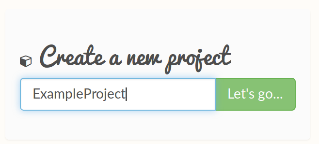

Quickstart
==========

To get started, enter a project name under the 'Create a new project' heading and click 'Let's go'. This will enable you to track your projects and modify the datasets later. Alternatively, you can load a template dataset.

Creating a new project will take you through to the main page - where you can define the variables and the insights in your personalised generated dataset. The overall project name is displayed on the top left-hand side. Below, you can re-name the table you are about to generate – this is especially relevant if you plan on generating multiple tables in the same project.

.. image:: images/quickstart/projectscreen.png

To the right of the project name, you will see four tabs titled 'Columns', 'Insights', 'Preview' and 'Export' respectively. These tabs will lead you through the process of generating a dataset using DataBake. 

Firstly, define the column variables by clicking the 'Add' button underneath the 'Columns' tab. A dialog box will appear and, as you can see, there is a dropdown menu containing a wide range of pre-defined columns arranged by category. There is also the option to generate your own customer columns.

For this example, the first pre-defined column we will be adding is **Name** - which creates a column filled with randomly generated full names. Click 'Submit' and a table with 'Name' in the column field will appear.

(screenshot of table)

Next, click 'Add' again, scroll down the dropdown menu to demographic data and select **Age**. Click 'Submit' and the 'Age' column will appear in the same table as 'Name'. 

As an example, next 'Add' in a custom column. Type an example column name, such as 'Number'. Click on the 'Provider' dropdown menu, and select 'Normal'. This will add a third column to the table.

(screenshot of table with 3 columns)

Now the columns are defined, click on the 'Insights' tab to determine the relationships between the variables. 

Click 'Add' and another dialog box will appear. Click on the 'Column' dropdown menu and select 'Number'. In the 'Mean' box type ``1 * age``. As you type 'age', a blue box will appear below – click on this and the text will automatically update to ``1 * (Age)``. Click 'Submit' and a connection will be shown between 'Age' and 'Number' in the column relationships box on the left hand side. 

You can now click on 'Preview' to view your dataset and insights in a table and charts.
(screenshot of preview)

Finally, click the 'Export' tab to export your dataset and share DataBake on Facebook.
